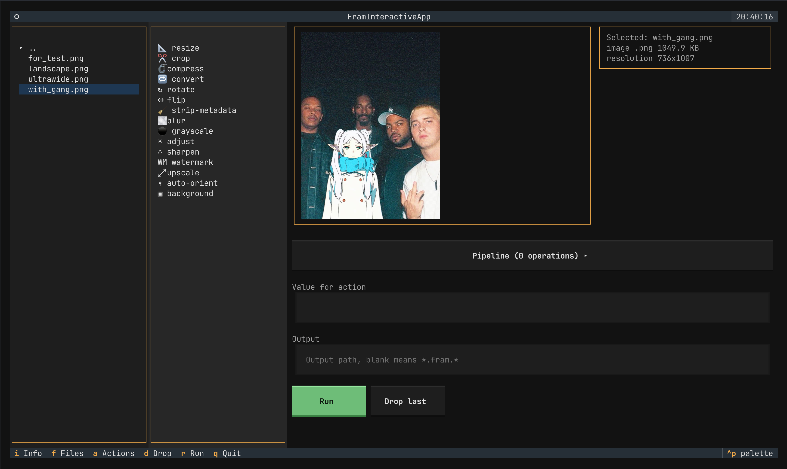

# 🖼️ Fram

[](https://www.python.org/)
[](LICENSE)
[](https://typer.tiangolo.com/)
[](https://ffmpeg.org/)

<p align="center">
  
</p>

A compact media workshop for your terminal and agent automation.

Fram crops, resizes, compresses, and converts images; cuts, resizes, crops, compresses, changes FPS, strips audio, extracts frames, and makes GIFs from videos. The CLI uses a typed processing core.

> Early hobby project. The strict CLI and basic interactive TUI are the main focus.

## Highlights

- Scriptable CLI commands for image and video edits.
- Interactive terminal UI for quick manual workflows.
- Bundled agent skill so AI coding agents can drive Fram directly.
- Shared core used by the CLI.
- FFmpeg-backed video processing with Pillow-backed image operations.
- Small codebase intended to stay hackable.

## Install

Fram requires Python 3.11+ and FFmpeg. For manual global installs, use either `uv` or `pipx`.

```bash
ffmpeg -version
uv --version
pipx --version
```

Install with the script:

```bash
curl -LsSf https://fram.serhiifotex.dev/install.sh | sh
```

Homebrew support is planned through a tap, which will install FFmpeg automatically:

```bash
brew tap Sergio-prog/fram
brew install fram
```

Manual install with `uv tool`:

```bash
uv tool install git+https://github.com/Sergio-prog/fram.git
```

Manual install with `pipx`:

```bash
pipx install git+https://github.com/Sergio-prog/fram.git
```

After the first PyPI release, the manual commands become:

```bash
uv tool install fram
pipx install fram
```

From a local checkout:

```bash
scripts/install.sh
uv tool install .
pipx install .
```

For development:

```bash
uv --version
uv sync --all-extras
uv run fram --help
```

## Agent Skill

Fram ships an agent skill at [`skills/SKILL.md`](skills/SKILL.md) so AI coding agents (Claude Code, and any tool that reads the [Agent Skills](https://code.claude.com/docs/en/skills) format) can discover and drive the CLI.

Install it for Claude Code by copying the skill into your skills directory:

```bash
mkdir -p ~/.claude/skills/fram
cp skills/SKILL.md ~/.claude/skills/fram/SKILL.md
```

Use `.claude/skills/fram/` inside a project instead of `~/.claude/skills/` to scope it to a single repository. Once installed, the agent picks up Fram automatically when a task involves inspecting or editing local image and video files.

## Quick Start

```bash
fram info image.jpg
fram resize image.jpg 128x128 -o image-small.jpg
fram convert image.png webp -o image.webp

fram cut video.mp4 --start 00:00:05 --end 00:00:12 -o clip.mp4
fram gif video.mp4 --fps 12 --width 480 -o clip.gif
fram strip-audio video.mp4 -o silent.mp4
```

Help works both ways:

```bash
fram resize --help
fram help resize
```

Updates:

```bash
fram update --check
fram update
```

Fram checks GitHub Releases occasionally and prints a small notice in interactive terminals when a newer release exists. Set `FRAM_UPDATE_CHECK=0` to hide update checks.

## CLI Commands

### Images

```bash
fram resize image.jpg 128x128 -o image-small.jpg
fram crop image.jpg 128x128 --anchor center -o avatar.jpg
fram compress-image image.jpg --quality 80 -o compressed.webp
fram convert image.png webp -o image.webp
fram rotate image.jpg 90 -o rotated.jpg
fram flip image.jpg --horizontal -o flipped.jpg
fram strip-metadata image.jpg -o clean.jpg
fram blur image.jpg --radius 2 -o blurred.jpg
fram grayscale image.jpg -o gray.jpg
fram adjust image.jpg --brightness 1.1 --contrast 1.2 -o adjusted.jpg
fram sharpen image.jpg --factor 2 -o sharp.jpg
fram watermark image.jpg "FRAM" --position bottom-right -o watermarked.png
fram upscale image.jpg --factor 2 -o large.jpg
fram auto-orient image.jpg -o oriented.jpg
fram background transparent.png white -o flattened.jpg
```

### Videos

```bash
fram cut video.mp4 --start 00:00:05 --end 00:00:12 -o clip.mp4
fram cut video.mp4 --start 5 --duration 10 -o clip.mp4
fram fps video.mp4 24 -o video-24fps.mp4
fram compress-video video.mp4 --crf 24 --preset medium -o smaller.mp4
fram strip-audio video.mp4 -o silent.mp4
fram extract-audio video.mp4 -o audio.m4a
fram extract-frame video.mp4 --at 00:00:05 -o frame.png
fram gif video.mp4 --fps 12 --width 480 -o clip.gif
fram speed video.mp4 2 -o fast.mp4
fram reverse video.mp4 --no-audio -o reversed.mp4
fram grayscale video.mp4 -o gray.mp4
fram rotate video.mp4 90 -o rotated.mp4
fram flip video.mp4 --horizontal -o flipped.mp4
fram mute-audio video.mp4 -o muted.mp4
fram thumbnail video.mp4 --at 00:00:05 -o thumbnail.png
fram contact-sheet video.mp4 --columns 3 --rows 3 -o sheet.png
fram extract-subtitles video.mp4 -o subtitles.srt
```

## Interactive Mode

```bash
fram
fram image.jpg
fram video.mp4
```

Interactive preview uses terminal image protocols through `textual-image`; videos show an extracted frame.

TUI shortcuts:

- `i`: toggle detailed info
- `a`: focus actions
- `d`: drop last operation
- `Up` / `Down`: switch active slider
- `Left` / `Right`: adjust active slider
- `r`: run
- `q`: quit

## Supported Media

Images:

- input: `jpg`, `jpeg`, `png`, `webp`, `bmp`, `tif`, `tiff`
- output: `jpg`, `png`, `webp`
- SVG is detected, but true SVG editing is deferred.

Videos:

- input: common FFmpeg-readable formats like `mp4`, `mov`, `mkv`, `webm`, `avi`, `gif`
- output: depends on output suffix and local FFmpeg codecs

## Development

```bash
uv sync --all-extras
uv run --all-extras --group dev python -m pytest
uv run --all-extras --group dev ruff check .
```

Docs:

- [Architecture](docs/architecture.md)
- [CLI](docs/cli.md)
- [Media Support](docs/media-support.md)
- [Roadmap](docs/roadmap.md)
- [Releasing](docs/releasing.md)

## License

MIT. See [LICENSE](LICENSE).
